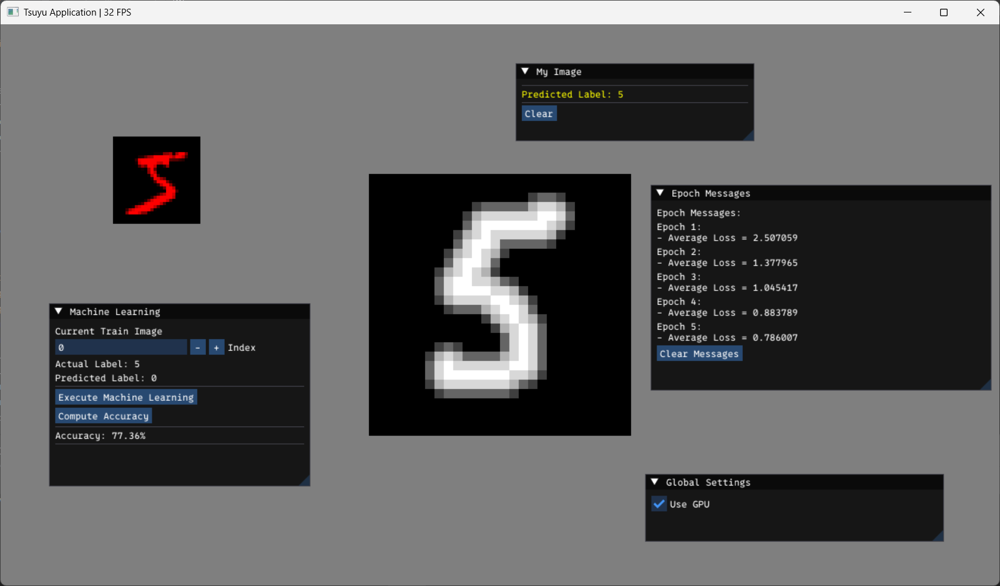

# SimpleOCR

This is an experimental project for my studies.

## About

**SimpleOCR** is a compact demonstration project for experimenting with optical character recognition (OCR) using a
basic feed-forward neural network. The code trains and evaluates a neural network on the MNIST handwritten digit
dataset. This project is built on top of my tiny game engine built on DirectX 12, **Tsuyu**, and is designed to be
lightweight and easy to extend for machine learning experiments.



## Features

- Fully connected neural network with:
    - 784 input nodes (28×28 MNIST images, flattened)
    - 1 hidden layer with 128 nodes and sigmoid activation
    - 10 output nodes with softmax activation (for digits 0–9)
- Training configuration:
    - Batch size: 100
    - Learning rate: 0.01
    - Epochs: 5
- Optional GPU acceleration for faster training and inference (when available)

## Dataset

The network is trained on the [MNIST dataset](http://yann.lecun.com/exdb/mnist/), which must be downloaded separately.
Place the following four files in the `SimpleOCR/asset/dataset/` directory:

- `train-images.idx3-ubyte`
- `train-labels.idx1-ubyte`
- `t10k-images.idx3-ubyte`
- `t10k-labels.idx1-ubyte`

> Note: The dataset is not included in this repository due to size and licensing restrictions.

## Build Instructions

Before building, ensure that a folder named `Tsuyu` exists at the root of this repository. If your **Tsuyu** engine
source is located elsewhere, create a symbolic link to it using the following command in Command Prompt:

```cmd
mklink /J Tsuyu <absolute_path>
